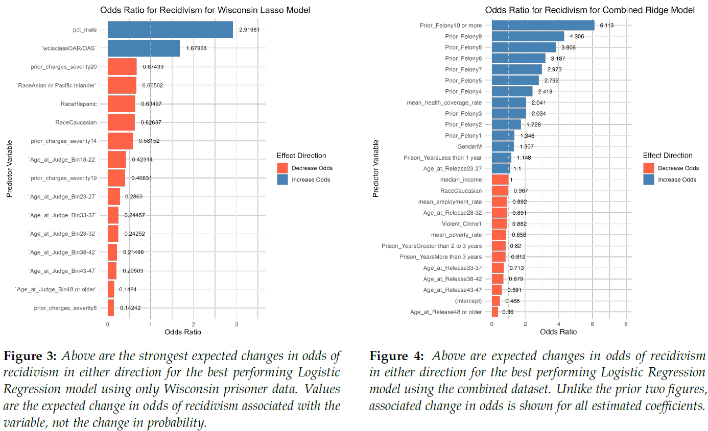

<link rel="stylesheet" href="https://cdnjs.cloudflare.com/ajax/libs/font-awesome/6.5.0/css/all.min.css">

<h1 align="center">Data Analyst</h1>

  
  
  

 

---

### Education
<ul>
  <li>MS Analytics, Georgia Tech </li>
  <li>BA Psychology, University of Maryland </li>
</ul>

---

### Projects

<a href="./assets/ISYE6414_finalreport_group90.pdf" target="_blank"><strong>A Comparative Multi-State Analysis of Criminal Recidivism Risk Factors</strong></a>

Built logistic regression and Lasso models to predict two-year recidivism risk using prison data from Georgia and Wisconsin, supplemented with U.S. census microdata. The Georgia model achieved AUC 0.777, competitive with published actuarial tools. Key findings: employment stability and program attendance are the strongest protective factors against reoffending.

  R
  Python
  Logistic Regression
  Lasso Regression
  VIF Analysis
  Data Cleaning

Code example: [Georgia Dataset](https://github.com/sflax91/portfolio/blob/main/assets/georgianotebook.pdf)

  

<a href="./assets/team005final.pdf" target="_blank"><strong>From Risk Labels to Timelines: Predicting When Species Will Go Extinct</strong></a>

Built logistic regression models to classify extinction risk across thousands of species using IUCN Red List data. Compared three model configurations — intrinsic traits only, extrinsic pressures only, and combined — finding that the combined model achieved the strongest performance (AUC: 0.92), with land/water management and interbirth interval emerging as the most influential predictors. Outputs were used downstream to forecast species-level extinction timelines.

  Python
  R
  Logistic Regression
  Data Imputation
  One-Hot Encoding
  pandas

Code example: [Logistic Regression](https://github.com/sflax91/portfolio/blob/main/assets/logisticnotebook.pdf)

<a href="./assets/ISYE%206501%20Course%20Project.pdf" target="_blank"><strong>Calimax Grocery Chain: Inventory Optimization Case Study</strong></a>

Designed an integrated analytical framework for a Mexican grocery chain to reduce spoilage and optimize inventory allocation across stores. Applied Weibull distribution modeling to estimate perishable spoilage probabilities and shelf-life thresholds, Holt-Winters exponential smoothing to forecast seasonal and trended demand, and linear optimization to minimize total costs subject to demand, capacity, and shelf-life constraints.

  Weibull Distribution
  Exponential Smoothing
  Linear Optimization
  Time Series Forecasting
  Predictive Modeling

---

